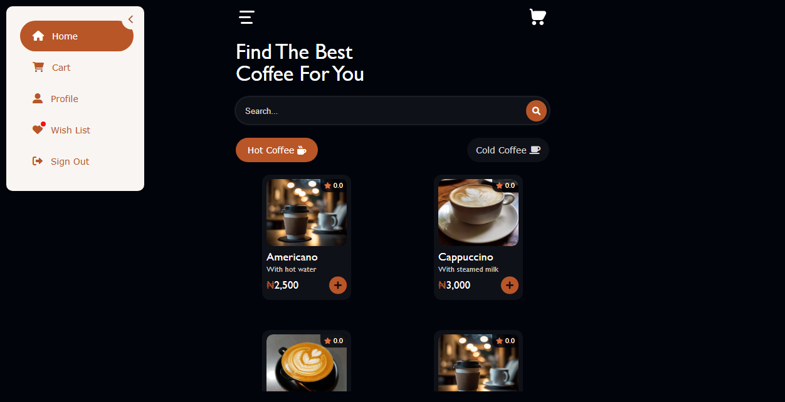

# Coffee-Shop-Application

# Guide:

* Step 1. Clone the project

* Step 2. Copy "Coffee Shop" folder

* Step 3. Paste it inside root directory(for xampp xampp/htdocs, for wamp wamp/www, for lamp var/www/html)

* Step 4. Open PHPMyAdmin Using This Link (http://localhost/phpmyadmin)

* Step 5. Create a database with name "coffeeshop"

* Step 6. Import "coffeeshop.sql" DB file (given inside the zip package in SQL file folder)

* Step 7. Run the following link in your browser (http://localhost/Coffee Shop)

To Access admin Panel run the following link (http://localhost/project folder/admin)

# Login Details For User:

For User:
* Phone: 08138028142
* Password: 123456

# For Admin:
* Email: abdulmajeedone23@gmail.com
* Password: 123456
